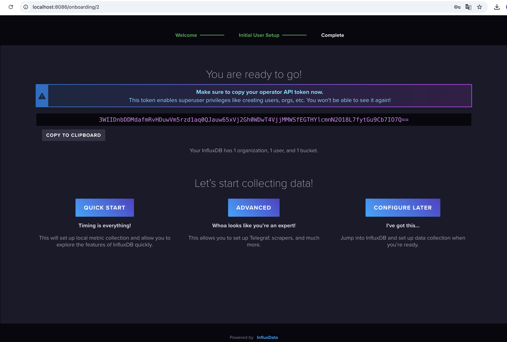
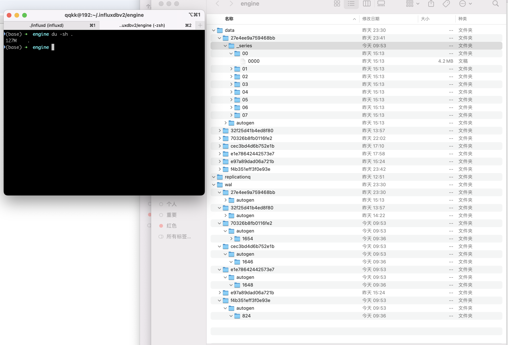

https://zhuanlan.zhihu.com/p/682852899

https://blog.csdn.net/G_D0120/article/details/139418187

https://docs.influxdata.com/influxdb/v2/get-started/

https://blog.csdn.net/u014694915/article/details/137956583

admin

admin123

3WIIDnbDDMdafmRvHDuwVm5rzd1aq0QJauw65xVj2Gh0WDwT4VjjMMWSfEGTHYlcmnN2O18L7fytGu9Cb7IO7Q==



influx config create --config-name onboarding
    --host-url "http://localhost:8086"
    --org "5469caff5112762e"
    --token "3lR92AhlSEUqy4vU7baECT9lJM7vlcfaBpW2VH717koCaFTQ0jvhqam2gW70jz01sN8c4nHFRMvbIqlff1UhmA=="
    --active

```


influx config create --config-name QATeam
    --host-url "http://localhost:8086"
    --org "5469caff5112762e"
    --token "3lR92AhlSEUqy4vU7baECT9lJM7vlcfaBpW2VH717koCaFTQ0jvhqam2gW70jz01sN8c4nHFRMvbIqlff1UhmA=="
    --active


./influx config create --config-name may2024\
--host-url http://localhost:8086 \
--org "mayInfluxDB" \
--token "3WIIDnbDDMdafmRvHDuwVm5rzd1aq0QJauw65xVj2Gh0WDwT4VjjMMWSfEGTHYlcmnN2O18L7fytGu9Cb7IO7Q==" \
--active

./influx bucket create --name symbol_info -c may2024


import "date"

from(bucket: "symbol-bucket-200408")
  |> range(start: 0, stop: now())
  |> filter(fn: (r) => r["_measurement"] == "symbol")
  |> filter(fn: (r) => r["_field"] == "price")
  |> filter(fn: (r) => r["symbol_id"] == "BTC_USDT_111")
  |> keep(columns: ["_time" ,"source" ,"symbol_id" ,"_value"])
//   |> pivot(rowKey:["_time"], columnKey: ["_field"], valueColumn: "_value")
//   |> yield(name: "time")
  
```

https://grafana.com/docs/grafana/latest/setup-grafana/installation/mac/

https://blog.csdn.net/weixin_45589713/article/details/136059049

https://cloud.tencent.com/developer/article/2305835

https://blog.csdn.net/weixin_52315708/article/details/140752367

http://localhost:8086/api/v2/config



